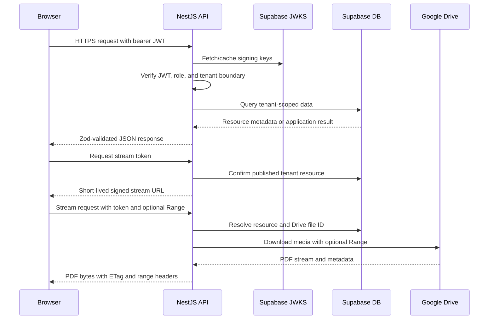

# IT-SUM Architecture

## Purpose

This document describes the backend architecture of IT-SUM and defines the boundaries that the frontend, API, database, and Google Drive integration must respect. The design favors a contract-first monorepo, explicit tenant identity, short-lived access tokens for PDF delivery, and an incremental migration path from the backend foundation to the full learning platform.

## System boundaries

| Boundary | Responsibility | Must not do |
|---|---|---|
| `apps/web` | Browser experience, bilingual UI, authenticated navigation, PDF viewer, quiz and progress screens. | Must not contain service-role keys or bypass API authorization. |
| `apps/api` | Authentication, authorization, validation, resource queries, Drive coordination, stream-token issuance, and operational APIs. | Must not expose provider secrets or trust client-supplied tenant IDs without verification. |
| `packages/shared` | Zod schemas and inferred TypeScript types shared by API and frontend. | Must not contain database clients or runtime secrets. |
| `packages/drive` | Typed Google Drive adapters for OAuth-user and Shared Drive modes. | Must not decide application roles or tenant permissions. |
| Supabase | Auth, relational data, vector data, audit records, usage records, and RLS enforcement. | Must not be treated as a file store for original PDFs. |
| Google Drive | Source of PDF files and Drive change history. | Must not be queried directly by the browser. |

## Request lifecycle



## Authentication and identity

Supabase Auth issues the access token. The token must contain a UUID subject, a UUID `university_id`, and one of the supported roles: `student`, `admin`, or `owner`. The API verifies the token using the project JWKS URL and validates the claims through `TenantClaimsSchema` from `packages/shared`.

The request user is represented internally as:

```ts
interface AuthUser {
  sub: string;
  universityId: string;
  role: "student" | "admin" | "owner";
  email?: string;
}
```

The API uses three global guards. `JwtAuthGuard` requires a bearer token unless a route is marked public. `RolesGuard` checks route metadata created by `@Roles(...)`. `TenantGuard` rejects an `x-university-id` header, route parameter, or query parameter that does not match the authenticated claim.

## Tenant model

A university is the tenant root. Tenant-owned tables contain `university_id` so that filtering and RLS policies can be applied consistently. User-owned records also contain `user_id`. The API service layer filters resource reads by the authenticated `universityId`; the database must provide equivalent RLS policies before production use.

The intended authorization precedence is:

1. A valid Supabase signature is required.
2. The JWT subject must be a known profile.
3. The profile must belong to the requested university.
4. The profile status must allow the requested operation.
5. The role must satisfy the route requirement.
6. The database policy must allow the row operation.

## API module responsibilities

| Module | Responsibility |
|---|---|
| `auth` | Public-route metadata, current-user decorator, JWKS verification, JWT guard, role guard, and tenant guard. |
| `config` | Zod environment parsing and the typed environment DI token. |
| `common` | Optional Supabase service-role client wrapper. Local boot is possible without the service-role key, but data operations are unavailable. |
| `health` | Liveness endpoint for probes and deployment checks. |
| `resources` | Tenant-filtered resource listing, stream-token issuance, stream-token verification, and PDF response handling. |
| `drive` | OAuth state, Google adapter selection, encrypted refresh-token persistence, Drive delta state, and admin sync endpoint. |

## Contract-first rule

The API should not introduce a new response interface when a corresponding schema exists in `packages/shared`. A behavior change should follow this order:

1. Update or add the Zod schema.
2. Infer the TypeScript type from the schema.
3. Update API mapping and validation.
4. Update frontend client code.
5. Add or update tests and documentation.

## PDF delivery design

Original PDFs remain in Google Drive. The resource record stores the Drive file ID, checksum, title, size, MIME type, and publication state. A student first requests a stream token for a published resource. The API binds the token to the resource, user, and university and signs it with `STREAM_SIGNING_SECRET`.

The browser then requests the stream route with the signed token. The API does not require the user’s bearer token on the stream route because the short-lived token is the access credential. It still checks the resource’s tenant and publication state before forwarding the request. The proxy forwards a Range header where present and returns ETag, Last-Modified, Content-Length, Content-Range, and private cache headers where Google provides them.

## Data ownership

Google Drive is the canonical source for original PDF bytes and Drive-level change history. Supabase is the canonical source for users, tenant structure, resource metadata, publication state, classifications, progress, quiz attempts, rewards, notifications, audit data, AI usage, and document chunks. A future ingestion worker reconciles Drive changes into Supabase and preserves the Drive file ID and checksum for idempotency.

## Operational evolution

The current repository is a backend foundation rather than a complete production platform. The next architectural steps are a dedicated RLS migration, a durable ingestion worker, provider-specific AI services, quiz and progress APIs, notification scheduling, and frontend integration tests. Each step should retain the same tenant, contract, and secret-handling boundaries.

## References

[1]: https://docs.nestjs.com/ "NestJS documentation"
[2]: https://supabase.com/docs/guides/auth/jwts "Supabase JWT documentation"
[3]: https://supabase.com/docs/guides/database/postgres/row-level-security "Supabase Row Level Security documentation"
[4]: https://developers.google.com/drive/api/guides/about-sdk "Google Drive API documentation"
